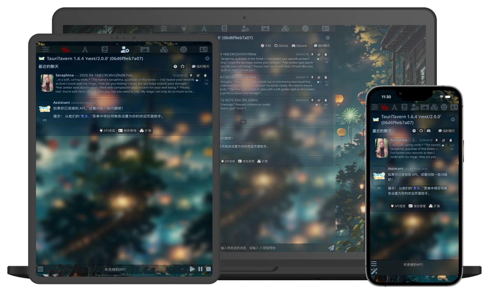

<div align="center">


# TauriTavern

**SillyTavern 的原生应用 —— 桌面与移动，开箱即用**

**简体中文** · [English](README.en.md) · [日本語](README.ja.md) · [Русский](README.ru.md) · [Português (Brasil)](README.pt-BR.md)

[下载](https://tauritavern.github.io/downloads/) · [文档](https://tauritavern.github.io/) · [Releases](https://github.com/Darkatse/TauriTavern/releases) · [Issues](https://github.com/Darkatse/TauriTavern/issues)

[](https://github.com/Darkatse/TauriTavern/releases/latest)
[](LICENSE)
[](https://github.com/Darkatse/TauriTavern/stargazers)
[](https://tauritavern.github.io/downloads/)
<br/>
[](https://t.me/TauriTavern)
[](https://discord.gg/hn57aFGe8h)
[](https://github.com/Darkatse/TauriTavern/issues)
[](https://github.com/Darkatse/TauriTavern/actions/workflows/canary-release.yml)

</div>

## 下载

<div align="center">

[](https://tauritavern.github.io/downloads/)

**自动识别你的设备 · 一键获取最新稳定版**

[](https://tauritavern.github.io/downloads/platforms/)
[](https://tauritavern.github.io/downloads/platforms/)
[](https://tauritavern.github.io/downloads/platforms/)
[](https://tauritavern.github.io/downloads/platforms/)
[](https://testflight.apple.com/join/gpqAdeTm)

[全部平台下载](https://tauritavern.github.io/downloads/platforms/) · [GitHub Releases](https://github.com/Darkatse/TauriTavern/releases)

</div>

<details>
<summary><b>📦 使用包管理器安装</b>（Windows · macOS · Linux）</summary>

### Windows · Scoop

在 PowerShell 中运行：

```powershell
scoop bucket add Darkatse https://github.com/Darkatse/Scoop-Darkatse.git
scoop install Darkatse/TauriTavern
```

### macOS · Homebrew

在终端中运行：

```sh
brew install --cask tauritavern
```

### Linux

**Arch Linux · AUR**

使用你喜欢的 AUR 助手安装 [`tauritavern-bin`](https://aur.archlinux.org/packages/tauritavern-bin)：

```sh
yay -S tauritavern-bin
```

该软件包由 [@LX2000WASD](https://github.com/LX2000WASD) 维护，感谢他在 [TauriTavern-aur](https://github.com/LX2000WASD/TauriTavern-aur) 中的持续维护贡献！

**Debian · Ubuntu · Fedora · openSUSE · NixOS**

脚本会自动识别系统并选择合适的安装方式，也支持其他已经安装 Nix 的 Linux。

**稳定版**

```sh
curl -fsSL https://raw.githubusercontent.com/Darkatse/TauriTavern/main/scripts/install-linux.sh | sh
```

**Nix / NixOS**

已经安装 Nix 的用户可以直接加入当前用户 profile：

```sh
nix profile add github:Darkatse/TauriTavern#tauritavern
```

**Flatpak**

```sh
flatpak remote-add --user --if-not-exists \
  tauritavern \
  https://flatpak.tauritavern.com/tauritavern.flatpakrepo
flatpak install --user tauritavern com.tauritavern.client
```

</details>

### Canary

Canary 版本每天更新，包含最新功能和修复，但稳定性可能不如稳定版。如果你希望体验最新版本，或在稳定版中遇到问题，可以先尝试 Canary，确认问题是否已经修复。

Windows、macOS 和移动平台可从 [Canary Release](https://github.com/Darkatse/TauriTavern/releases/tag/Canary) 下载。

<details>
<summary><b>Linux Canary 安装</b></summary>

**Linux**

```sh
curl -fsSL https://raw.githubusercontent.com/Darkatse/TauriTavern/main/scripts/install-linux.sh \
  | sh -s -- --channel canary
```

**Nix / NixOS**

```sh
nix profile add github:Darkatse/TauriTavern/Canary#canary
```

</details>

> [!TIP]
> **iOS 用户**：通过 [TestFlight 公开外测](https://testflight.apple.com/join/gpqAdeTm) 安装，需要 iOS 16 或更高版本。请注意 TestFlight 版本需要遵守苹果的 TestFlight 规则，存在使用限制。
>
> **Windows 便携版**（Portable）：需系统已安装 WebView2 运行时。

## 这是什么

TauriTavern 把 [SillyTavern](https://github.com/SillyTavern/SillyTavern) 移植为真正的原生应用：前端完整保留上游体验（已同步 1.18.0），后端从 Node.js 重构为 Rust（Tauri v2）。

不需要安装 Node.js，不需要命令行，安装即用。你的角色卡、聊天记录、预设、世界书与前端扩展，全部兼容。

> 注：TauriTavern 是独立维护的开源项目，并非 SillyTavern 官方客户端。TauriTavern 完全免费且开源，遵循 AGPL-3.0 许可协议。请在使用前仔细阅读许可条款。

## 特性亮点

- 🖥️ **全平台原生**：Windows、macOS、Linux、Android、iOS，桌面与移动同一份体验
- 🎭 **完整 SillyTavern 体验**：前端同步上游 1.18.0，数据格式与目录布局完全兼容
- 🧩 **前端扩展生态**：内置原生 Git，安装、更新、切换分支都在界面内完成（不支持上游 Node-only 后端插件）
- 🔄 **内置多设备同步**：局域网加密配对同步，或经远端 TT-Sync v2 自动上传
- 🤖 **Agent 框架**：工具调用、Skills、子代理与运行时间线，持续演进中
- 📦 **一键迁移**：SillyTavern 数据导出脚本 + 应用内导入，平滑搬家
- ⚡ **性能工程**：分阶段启动、聊天虚拟DOM加载，超长聊天记录依然流畅
- 🔒 **数据自主**：数据完全保存在本地，支持便携模式

## 截图

<div align="center">

</div>

## 架构速览

本项目 Rust 后端是遵循 Clean Architecture 的 Cargo workspace（`src-tauri/crates/`）：

- `tauritavern`：Tauri host、命令层与组合根
- `tt-application` · `tt-ports` · `tt-domain` · `tt-contracts`：用例、端口、领域模型与跨 crate 契约
- `tt-adapter-*`：存储、HTTP、媒体、同步、扩展、分词等具体实现

前端为上游 SillyTavern + 模块化 Tauri 注入层（`src/tauri/main/`），经 `window.__TAURITAVERN__` 平台 ABI 与 Rust 后端通信。详情请见 [docs/BackendStructure.md](docs/BackendStructure.md) 与 [docs/FrontendGuide.md](docs/FrontendGuide.md)。

<details>
<summary><b>🛠 开发与构建</b>（前置要求 · 常用命令 · Tauri Pilot · 便携构建 · FasTools）</summary>

**前置要求**：Rust stable（支持 edition 2024）· Node.js 20.19.x 或 22.12+ · pnpm · Tauri CLI

```bash
git clone https://github.com/Darkatse/TauriTavern.git
cd TauriTavern
pnpm install
```

**常用命令**：

```bash
pnpm run check         # 前端 guardrails/类型/契约 + Rust dev check
pnpm run web:build     # 构建前端资源包（Rspack）
pnpm run tauri:dev     # 桌面开发模式
pnpm run tauri:build   # 构建桌面发行包
pnpm run android:dev   # Android 开发模式
pnpm run ios:dev       # iOS 开发模式
```

**Ubuntu 浏览器服务器**：

服务器使用独立的 `tauritavern-server` 二进制，复用同一套 Rust 业务/存储层，但不依赖 Tauri、GTK 或 WebKit。角色卡、聊天和设置统一落在 `--data-dir`，手机和电脑刷新后读取同一份进度。

Ubuntu 24.04 构建依赖：

```bash
sudo apt-get update
sudo apt-get install -y --no-install-recommends build-essential pkg-config cmake curl git
curl --proto '=https' --tlsv1.2 -sSf https://sh.rustup.rs | sh
sudo install -d -o "$USER" -g "$(id -gn)" /var/lib/tauritavern

corepack enable
pnpm install --frozen-lockfile
pnpm run server:build
```

从仓库目录启动（先用测试数据目录验证）：

```bash
./src-tauri/target/release/tauritavern-server \
  --data-dir /var/lib/tauritavern \
  --frontend-dir ./src \
  --resources-dir . \
  --host 127.0.0.1 \
  --port 8000 \
  --password '请改成强密码'
```


### Docker Compose 部署

Docker 镜像使用多阶段构建：Node/pnpm 只在构建阶段生成前端资源，Rust 工具链只在构建阶段编译 `tauritavern-server`；运行镜像不包含 Node.js。所有可变数据统一挂载到容器 `/data`。

```bash
cp .env.example .env
# 编辑 .env：至少设置一个长随机 TAURITAVERN_PASSWORD
docker compose build
docker compose up -d
docker compose logs -f tauritavern
```

默认端口只绑定宿主机 `127.0.0.1:8000`，适合由 Caddy/Nginx 反向代理并提供 HTTPS。如果确认要直接向局域网开放，再在 `.env` 中设置：

```dotenv
TAURITAVERN_BIND_ADDRESS=0.0.0.0
TAURITAVERN_PORT=8000
```

#### 从现有安装迁移数据

容器数据目录必须指向 **data root**，即里面直接包含 `default-user/`、`_tauritavern/` 和 `extensions/` 的目录。不要只复制 `chats/`，否则角色卡、设置、密钥、插件和 Agent 状态会缺失。

先停止旧实例并备份：

```bash
OLD_DATA=/原安装的数据根目录
STAMP=$(date +%Y%m%d-%H%M%S)
tar -C "$OLD_DATA" -czf "$HOME/tauritavern-data-$STAMP.tar.gz" .
```

再迁移到 Compose 配置的数据目录（示例为默认的 `./docker-data`）：

```bash
mkdir -p ./docker-data
rsync -a --info=progress2 "$OLD_DATA"/ ./docker-data/
docker compose up -d
```

镜像构建上下文通过 `.dockerignore` 排除了 `data/`、`docker-data/`、`.env*`、SQLite 文件和构建产物；真实数据与密钥不会进入镜像层。

#### 日常运维

```bash
# 状态 / 日志
docker compose ps
docker compose logs -f --tail=200 tauritavern

# 停止（保留宿主机数据）
docker compose down

# 更新代码和镜像
git pull --ff-only
docker compose build --pull
docker compose up -d --remove-orphans

# 在线容器数据备份（更稳妥时可先 docker compose stop）
STAMP=$(date +%Y%m%d-%H%M%S)
tar -C "${TAURITAVERN_DATA_DIR:-./docker-data}" \
  -czf "$HOME/tauritavern-data-$STAMP.tar.gz" .
```

`restart: unless-stopped` 会在 Docker/服务器重启后自动恢复容器。删除或重建容器不会删除宿主机 `TAURITAVERN_DATA_DIR`；不要使用会主动删除该目录的清理命令。
默认只监听 `127.0.0.1`。建议由 Caddy/Nginx 提供 HTTPS；如果直接使用 `--host 0.0.0.0`，服务器会要求设置 `--password`（也可通过 `TAURITAVERN_PASSWORD` 提供）。不要把 App 的数据目录直接用于首次调试；验证完成后再复制真实数据。

**Tauri Pilot（AI Agent 界面调试）**

项目已接入 [Tauri Pilot](https://github.com/mpiton/tauri-pilot) 的开发专用插件与权限。它让 AI Agent 通过可访问性快照检查和操作桌面端 WebView；普通开发与发行命令不会启用这项能力。

```bash
cargo install tauri-pilot-cli  # 仅首次需要
pnpm run tauri:dev:pilot
```

应用启动后，在另一终端按以下顺序操作：

```bash
tauri-pilot ping
tauri-pilot snapshot -i
tauri-pilot click @e3          # 使用当前 snapshot 返回的 ref
tauri-pilot diff -i
tauri-pilot logs --level error
```

交互前先取得 snapshot，每次只执行一个操作；异步更新后使用 `wait`，并优先用 `assert` 验证结果。支持 MCP 的 Agent 可将 `tauri-pilot mcp` 注册为 stdio server。

**便携版构建**：`pnpm run tauri:build:portable`（默认输出至 `release/`）；运行时可通过 `TAURITAVERN_RUNTIME_MODE=portable` 或 `portable.flag` 强制启用便携策略。

**FasTools**：超级好用的开发与部署调试工具箱，强烈推荐。`pnpm run fastools:build` 进行构建，`pnpm run fastools:run` 运行。

平台细节见 [docs/AndroidDevelopment.md](docs/AndroidDevelopment.md) 与 [docs/iOSDevelopment.md](docs/iOSDevelopment.md)。


</details>

## 文档

- 📖 [在线文档站](https://tauritavern.github.io/)：中英双语，含指南、Agent、架构、API 与下载
- [docs/FrontendGuide.md](docs/FrontendGuide.md)：前端架构与扩展指南
- [docs/FrontendHostContract.md](docs/FrontendHostContract.md)：宿主层对外契约
- [docs/BackendStructure.md](docs/BackendStructure.md)：后端 Clean Architecture 与 crate 边界
- [docs/CurrentState/](docs/CurrentState/README.md)：已落地模块的实现状态

## 贡献

欢迎 Issue 与 PR。提交前请阅读 [CONTRIBUTING.md](CONTRIBUTING.md)。除紧急修复外，PR 请以 `dev` 为目标分支。

## 致谢与许可

基于 [SillyTavern](https://github.com/SillyTavern/SillyTavern) 与 [Tauri](https://tauri.app/) 构建，并感谢 [Cocktail](https://github.com/Lianues/cocktail)、[Tavern-Helper](https://github.com/N0VI028/JS-Slash-Runner)、[LittleWhiteBox](https://github.com/RT15548/LittleWhiteBox)、[MikTik](https://github.com/Darkatse/MikTik)，以及维护 [TauriTavern AUR 软件包](https://github.com/LX2000WASD/TauriTavern-aur) 的 [@LX2000WASD](https://github.com/LX2000WASD)。

以 [AGPL-3.0](LICENSE) 许可发布（与 SillyTavern 同系列许可协议）。

[](https://github.com/Darkatse/TauriTavern/graphs/contributors)

<p align="center"><sub><em>我们尽力用爱打造 ❤️ —— TauriTavern 团队</em></sub></p>
